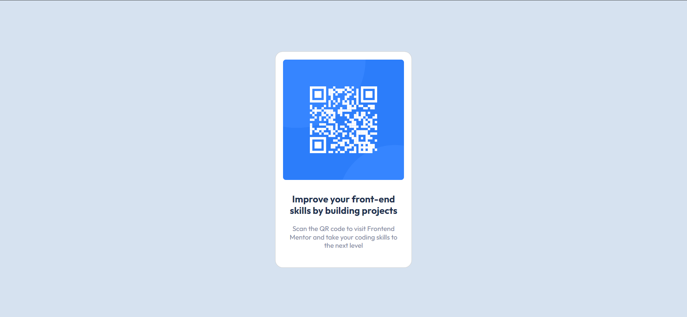

# Frontend Mentor - QR code component solution

This is a solution to the [QR code component challenge on Frontend Mentor](https://www.frontendmentor.io/challenges/qr-code-component-iux_sIO_H). Frontend Mentor challenges help you improve your coding skills by building realistic projects.

## Table of contents

- [Overview](#overview)
  - [Screenshot](#screenshot)
  - [Links](#links)
- [My process](#my-process)
  - [Built with](#built-with)
  - [What I learned](#what-i-learned)
  - [Continued development](#continued-development)
  - [Useful resources](#useful-resources)
- [Author](#author)
- [Acknowledgments](#acknowledgments)

## Overview

### Screenshot



### Links

- Solution URL: [Frontend Mentor](https://www.frontendmentor.io/solutions/qr-code-component-using-css-flexbox-G3cUFQinmK)
- Live Site URL: [Github Pages](https://110nard0.github.io/frontend-mentor-qrcode/)

## My process

### Built with

- Semantic HTML5 markup
- CSS custom properties
- Flexbox
- Mobile-first workflow
- [Bootstrap](https://getbootstrap.com/) - For styles

### What I learned

I learned how to work with SaSS. It was my first time using Sass in a project environment so I spent much of the time figuring out the installation process then setting up my ```PATH```. Once I got the hang of it, the rest of my work was easier. One thing I appreciated was the ability to nest CSS selectors like this:

```scss
.card {
 background-color: $white;
 font-family: $font-specimen;

 .card-body {
  text-align: center;

  .card-title {
   font-weight: 700;
   font-size: $header-font;
   padding: $font-padding;
   color: $blue;
  }

  .card-text {
   font-weight: 400;
   font-size: $paragraph-font;
   padding: $font-padding;
   line-height: 1.25;
   color: $ash;
  }
 }
}
```

### Continued development

I want to gegt better at measuring width and height of components without access to design files. In my project, I used a plain Bootstrap ```.card``` class and it did not match the specifications in the solution.

### Useful resources

- [Practical Typography](https://practicaltypography.com/line-spacing.html) - This helped me reproduce typographic elements accurately. I really liked this pattern and will adhere to - most of - it going forward.
- [Sass Basics](https://sass-lang.com/guide) - This is a guide to working with Sass. I like how it starts from the basics and builds up on existing knowledge.
- [Install Sass](https://getbootstrap.com/docs/5.2/getting-started/introduction/) - Sass Installation Docs.
- [Intro to Bootstrap](https://getbootstrap.com/docs/5.2/getting-started/introduction/) - Bootsrap Introduction Docs.

## Author

- Github - [110nard0](https://www.your-site.com)
- Frontend Mentor - [@110nard0](https://www.frontendmentor.io/profile/110nard0)
- Twitter - [@110nard0](https://www.twitter.com/110nard0)

## Acknowledgments

My sincere thanks goes to the Frontend Mentor community for their help, both active and passive, in making become a better web developer.
